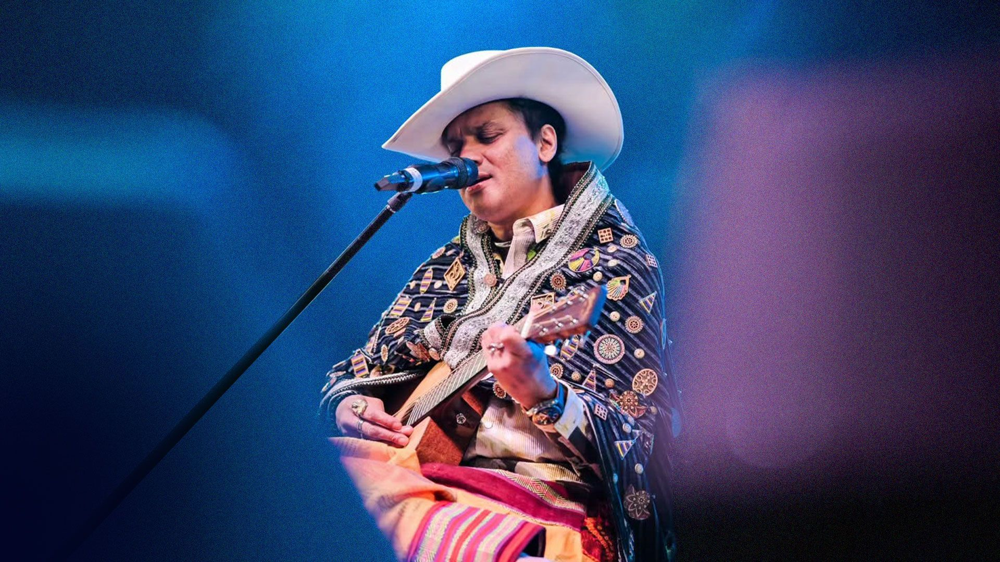

<div align="center">

# 🪔 ZUBEEN FM

### 🎵 সুৰত জীয়াই থকা এটা নাম — জুবিন

<p>
  
</p>

<p>
  
</p>

# শ্ৰদ্ধাঞ্জলী

## ❤️ Heartthrob ZUBEEN DA

### ১৮-১১-১৯৭২ — ১৯-০৯-২০২৫

> **“তোমাৰ সুৰে আমাক সদায় জীয়াই থকাৰ সাহস দিব, জুবিন দা।”**

### 🪔

> **“তুমি নাথাকিলেও তোমাৰ সুৰে সদায় কথা পাতি থাকিব।”**

</div>

---

# 🎵 ZUBEEN FM

**ZUBEEN FM** হৈছে জুবিন গাৰ্গৰ সংগীত, স্মৃতি আৰু অসমীয়া সংস্কৃতিলৈ
তেওঁৰ অৱদানৰ প্ৰতি উৎসৰ্গিত এটা ব্যক্তিগত, অ-বাণিজ্যিক Android প্ৰকল্প।

> **“এটা কণ্ঠ, এটা সুৰ, এটা যুগ — জুবিন।”**

এই প্ৰকল্পটোৰ মূল উদ্দেশ্য হৈছে এটা আধুনিক সংগীত অভিজ্ঞতাৰ মাজেৰে
জুবিন দাৰ সংগীত আৰু স্মৃতিক সন্মান জনোৱা।

---

## 🪔 আমাৰ শ্ৰদ্ধাঞ্জলী

> **“জুবিন দা, তোমাৰ গান কেৱল গান নহয় —
> সেয়া আমাৰ অনুভৱ, আমাৰ স্মৃতি আৰু আমাৰ জীৱনৰ এটা অংশ।”**

> **“তোমাৰ সুৰত আমি হাঁহিছোঁ, কান্দিছোঁ,
> ভাল পাইছোঁ আৰু জীৱনক নতুনকৈ অনুভৱ কৰিছোঁ।”**

> **“অসমৰ আকাশত তোমাৰ সুৰৰ প্ৰতিধ্বনি
> সদায় বাজি থাকিব।”**

---

# ✨ Features

## 📻 ZUBEEN FM Radio

A dedicated Zubeen Garg radio experience featuring:

- 🪔 Universal synchronized radio station
- 🎵 Zubeen Garg music catalogue
- 🔄 Independent radio station schedule
- 🎧 Continuous playback
- 📊 Modern audio visualization
- ▶️ Play / Pause
- 🔒 Background playback
- 📱 Android media notification
- 🔐 Lock-screen controls
- 🚫 No advertisements
- 🚫 No RJ interruptions
- 🚫 No playback countdown timer

> **“ৰেডিঅ' বন্ধ হ'ব পাৰে, কিন্তু সুৰ কেতিয়াও বন্ধ নহয়।”**

---

# 🎶 Assamese Music Library

Normal Songs Mode focuses on **Assamese-language music**.

The catalogue is designed to discover Assamese music from different
generations, including:

- 🎵 Songs
- 💿 Albums
- 👤 Artists
- 🎼 Genres
- 🔎 Search
- ❤️ Favorites
- 🕘 Recently Played

The general catalogue follows a strict Assamese-language filtering
architecture.

---

# ⭐ Zubeen Garg Collection

Zubeen Garg has a dedicated artist catalogue.

Unlike the general Assamese catalogue, the **Zubeen Garg artist section**
can contain verified recordings in their original languages.

Examples may include:

- অসমীয়া
- हिन्दी
- বাংলা
- English
- Other verified original languages

Original titles and language information are preserved.

### No automatic translation

> **“গানৰ ভাষা সলনি নহয় — যি ভাষাত সৃষ্টি, সেই ভাষাতেই সন্মান।”**

---

# 🪔 Tribute Experience

The Tribute section is designed as a digital memorial.

It includes:

- 🪔 Animated diya
- ❤️ Heartthrob ZUBEEN DA
- 🌹 Interactive rose petals
- 📸 Zubeen Garg portrait
- ✨ Memorial animations
- 📖 Assamese stories
- 💡 Assamese facts
- 📝 Tribute message

Touching the portrait triggers a soft rose-petal memorial animation.

> **“ফুল সৰি যায়, সময় পাৰ হৈ যায়,
> কিন্তু সুৰৰ স্মৃতি কেতিয়াও ম্লান নহয়।”**

---

# 🌹 জুবিন দাৰ বাবে

<div align="center">

### 🪔

> **“তুমি গোৱা প্ৰতিটো সুৰত  
> অসমৰ মাটিৰ গোন্ধ আছিল।”**

> **“তুমি আমাৰ মাজত নাই,  
> কিন্তু তোমাৰ সুৰ আমাৰ মাজত সদায় আছে।”**

> **“তোমাৰ কণ্ঠৰ প্ৰতিটো সুৰ  
> আমাৰ হৃদয়ত সদায় বাজি থাকিব।”**

### ❤️

**জুবিন দা, তোমাৰ সুৰ কেতিয়াও শেষ নহয়।**

</div>

---

# 🏗️ Architecture

```text
                         ZUBEEN FM
                             │
              ┌──────────────┴──────────────┐
              │                             │
         NORMAL MODE                    RADIO MODE
              │                             │
              ▼                             ▼
    Assamese Music Library          Zubeen Garg Only
              │                             │
       ┌──────┼──────┐                      │
       │      │      │                      ▼
     Songs  Albums Artists            Verified Catalogue
       │      │      │                      │
       └──────┴──────┘                      ▼
                                      Radio Station Clock
                                             │
                                             ▼
                                       Radio Playback
